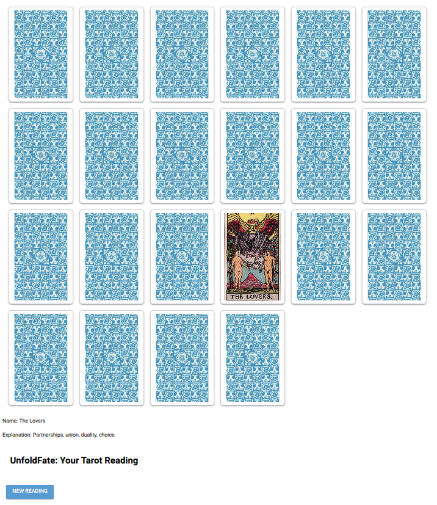

# UnfoldFate: A Tarot Reading Application

UnfoldFate is a demo application for near 100% generated code by an AI. It is a Tarot reading application built using [NiceGUI](https://nicegui.io/). This project demonstrates the capabilities of the OpenAI 03-mini-high model in generating functional code with minimal human intervention.

## Installation

To install and run the program, follow these steps:

1. Clone the repository:
    ```sh
    git clone https://github.com/yourusername/unfoldfate.git
    cd unfoldfate
    ```

2. Install [uv](https://github.com/uv-org/uv):
    Follow the instructions on the uv GitHub page to install uv.

3. Create a virtual environment and install dependencies using uv:

    ```sh
    uv pip sync
    ```
    This:
    - Reads dependencies from `pyproject.toml`
    - Installs them inside a virtual environment (`.venv/`)
    - Ensures your environment matches the locked dependencies

    To install locked dependencies only (like `poetry install --no-dev`):

    ```sh
    uv pip sync --only-locked
    ```


4. Activate the virtual environment:
    - On macOS/Linux:
        ```sh
        source .venv/bin/activate
        ```
    - On Windows:
        ```sh
        .venv\Scripts\activate
        ```

5. Run the application:
    ```sh
    python unfold_fate.py
    ```



## How It Was Generated

This unfold\_fate.py example as included was generated using the OpenAI 03-mini-high model. This took 4 passes to get it right. However, starting from [the original prompt ](initial_prompt.md), the first iteration was already quite good, substantially better than other models. TODO: include the prompt history for different models in the `prompt_log` directory for reference.

Caveat: the use of NiceGui is actually to the detriment of the model. It would seem that models have not had access to a larger enough dataset to really "know" all the ins and out of the library. A difference here is Claude which does significantly better in that respect. The solution is to provide the model with the right hints (e.g. see the last comment in the initial prompt about a “*if \_\_name\_\_ in {‘\_\_main\_\_’, ‘\_\_mp\_main\_\_’}” guard.”.* This is something which no model apart from Claude Sonnet gets right. 

## How It Works

- The application displays a grid of Tarot cards.
- When a card is clicked, it reveals the selected card and displays its name and explanation below the grid.
- The click event is disabled after a card is selected.
- Clicking the "New Reading" button resets the session, shuffles the cards, and re-enables the click event.

See: [User stories](user_stories.md) for the requirements. 

## License

This project is licensed under the MIT License. See the LICENSE file for details.


## Copyright
Copyright 2025 Iwan van der Kleijn